<!--toc:start-->

- [Introduction](#introduction)
- [Perform quantification against the transcriptome](#perform-quantification-against-the-transcriptome)
  - [Prepare your working environment](#prepare-your-working-environment)
  - [Download the genome and transcriptome for your organism of interest](#download-the-genome-and-transcriptome-for-your-organism-of-interest)
    - [Genome](#genome)
    - [Transcriptome](#transcriptome)
  - [Index and Quantify the RNAseq Data](#index-and-quantify-the-rnaseq-data)
- [Data analysis](#data-analysis)
  - [Prepare your sample table](#prepare-your-sample-table)
  - [Working Directory Structure](#working-directory-structure)
  - [Setup RStudio](#setup-rstudio)
  - [Start a new project in your project directory](#start-a-new-project-in-your-project-directory)
  - [Read in quantified abundance files](#read-in-quantified-abundance-files)
  - [QC](#qc)
  - [Differential expression analysis](#differential-expression-analysis)
- [Conclusion](#conclusion)

<!--toc:end-->

# Introduction

This brief tutorial will show you the general steps I use when analyzing RNAseq
data. A majority of this pipeline has been streamlined and many assumptions have
been made about the structure of the data and the experimental design as a
starting point for your analysis.

I will assume you have sequenced your samples using
[GeneWiz](https://www.genewiz.com/) and your data has either been downloaded via
their
[instructions](https://3478602.fs1.hubspotusercontent-na1.net/hubfs/3478602/13012-M%26G%200222%20sFTP%20Guide-3.pdf)
or you have a physical hard drive containing the data in your possession. You
will have a data structure that looks like the following:

- Project_ID
  - fastq_00
    - sampleID_R1_001.fastq.gz
    - sampleID_R2_001.fastq.gz
    - …

# Perform quantification against the transcriptome

We will first take our RNAseq data and quantify it against the reference
transcriptome for our organism of interest using
[Salmon](https://www.nature.com/articles/nmeth.4197).

> _**NOTE:**_ Variables you will need to change are in ALL CAPS

Open a BASH terminal session using whatever means your OS provides

> _**NOTE:**_ You will need to
> [install WSL](https://learn.microsoft.com/en-us/windows/wsl/install) if using
> Windows.

Install Salmon using the
[provided instructions](https://salmon.readthedocs.io/en/latest/building.html#binary-releases)
and make sure it is available in your `$PATH`.

## Prepare your working environment

Make a directory for you projects `mkdir PROJECTS`

Change into that directory `cd PROJECTS`

Make a directory for your project `mkdir MYPROJECT`

Change into that directory `cd MYPROJECT`

Copy the following code into a new file named `salmon_script.sh` in the
`MYPROJECT` directory. You may also download the file
[here](./files/salmon_script.sh).

> **_NOTE:_** The above assumes you have placed your read files in the current
> directory, if this is not the case you will need to edit the file to specify
> the location of the directory containing the .fastq files.

```bash
#!/bin/bash

#supply genome and transcriptome files from Ensembl, place in the directory where this script is located
#EXAMPLE genome "Homo_sapiens.GRCh38.dna.primary_assembly.fa.gz"  
#EXAMPLE transcriptome "Homo_sapiens.GRCh38.cdna.all.fa.gz"

# run this script with the following command `bash salmon_script.sh`

## EDIT ME if the `00_fastq` directory is not in the current directory
read_files="./00_fastq"
## EDIT ME 

##LEAVE ALONE
genome="dna.primary_assembly.fa.gz"
transcriptome="cdna.all.fa.gz"
threads="$(grep -c ^processor /proc/cpuinfo)"

grep "^>" <(gunzip -c ./*"$genome") | cut -d " " -f 1 >decoys.txt
sed -i.bak -e 's/>//g' decoys.txt

cat ./*"$transcriptome" ./*"$genome" >gentrome.fa.gz

salmon index -t gentrome.fa.gz -d decoys.txt -p "$threads" -i ./salmon_index

#quantify transcripts against index
destination_directory="./salmon_output"
index="./salmon_index"
for sample in "$read_files"/*_R1_001.fastq.gz; do
	base_name="${sample##*/}"
	echo "Processing sample ${base_name%%_R1_001*}"
	salmon quant \
		-i "$index" \
		--gcBias \
		-l A \
		-1 "${sample}" \
		-2 "${sample%%_R1*}_R2_001.fastq.gz" \
		-o "$destination_directory"/quants/"${base_name%%_R1*}"
	mapped=$(grep "percent" "$destination_directory"/quants/"${base_name%%_R1*}"/aux_info/meta_info.json | cut -d : -f 2 | cut -d , -f 1)
	echo "${base_name%%_R1*}" "$mapped" >>"$destination_directory"/mapped_percent.txt
done
##LEAVE ALONE
```

## Download the genome and transcriptome for your organism of interest

Retrieve these files from
[Ensembl Downloads](https://useast.ensembl.org/info/data/ftp/index.html)

### Genome

- Find your organism and click the first "FASTA" link for "DNA"
- Find the file named **"\*.primary_assembly.fa.gz"** and download it to your
  working directory.

### Transcriptome

- Find your organism and click the second "FASTA" link for "cDNA"
- Find the file named **"\*.cdna.all.fa.gz"** and download it to your working
  directory.

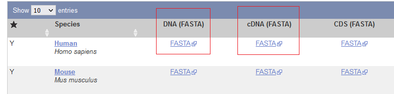

## Index and Quantify the RNAseq Data

Run the quantifying script by issuing the following command:
`bash salmon_script.sh`

> **_NOTE:_** This will take some time, be patient, maybe stretch, grab a coffee
> ☕, or have lunch 🥪

When quantifying is finished a directory titled "salmon_output" will be created
with a "quant.sf" file per sample. These files contain the quantified abundance
that will be analyzed next. You may now safely exit out of the command prompt by
pressing `CTRL-d`.

# Data analysis

This pipeline is based off
[this excellent vignette](http://bioconductor.org/packages/devel/bioc/vignettes/DESeq2/inst/doc/DESeq2.html)
on the subject written by the author of the analysis packages we will use.

## Prepare your sample table

Download [this example sample file](./files/samples.csv) and edit with the
relevant details about your samples you received from GeneWiz (or other
sequencing company).

The data should look like this:

| sample.id  | condition | RIN | DV200 |
| ---------- | --------- | --- | ----- |
| veh1       | vehicle   | 8.7 | 90.5  |
| treatment1 | treatment | 9.2 | 92.4  |
| …          | …         | …   | …     |

Make sure to save the file as a .csv (CSV UTF-8), this is the fifth option down
in the save-as dialog in Excel. The filename should be `samples.csv` and it
should be placed in the `MYPROJECT` directory.

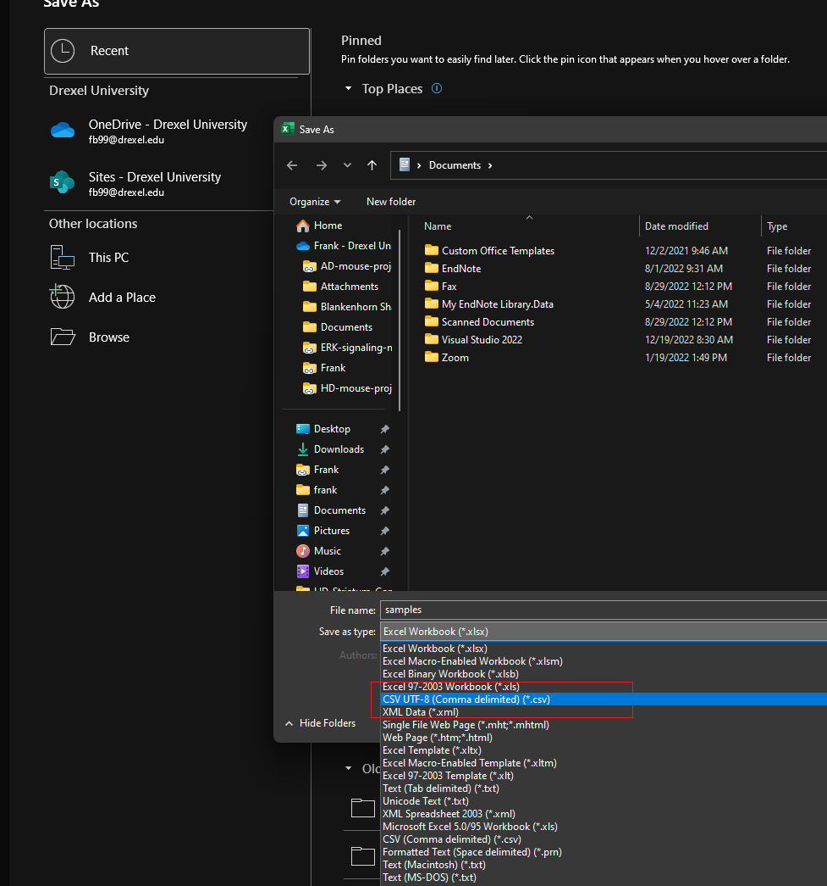

## Working Directory Structure

Your final working directory should now look like this:

- PROJECTS
  - MYPROJECT
    - 00_fastq/
      - sampleID_R1_001
      - sampleID_R2_001
      - …
    - salmon_output/
    - salmon_index/
    - salmon_script.sh
    - *.dna.primary_assembly.fa.gz
    - *.cdna.all.fa.gz
    - samples.csv

## Setup RStudio

We will use RStudio to perform the rest of the analysis, follow
[these instructions](https://posit.co/download/rstudio-desktop/) for
installation.

To get acclimated with RStudio, please consult
[this tutorial](https://www.datacamp.com/tutorial/r-studio-tutorial).

> **_NOTE:_** We will need to install several packages for this analysis, do so
> with the following code:

```r
install.packages("devtools")
devtools::install_github("fbearoff/CustomRFuncs")

if (!require("BiocManager", quietly = TRUE))
    install.packages("BiocManager")

BiocManager::install("DESeq2")
BiocManager::install("biomaRt")
BiocManager::install("tximport")
BiocManager::install("EnhancedVolcano")
BiocManager::install("ComplexHeatmap")
```

## Start a new project in your project directory

- Click "File -> New Project"

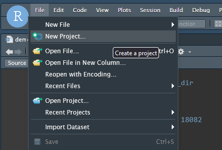

- Choose "Existing Directory"

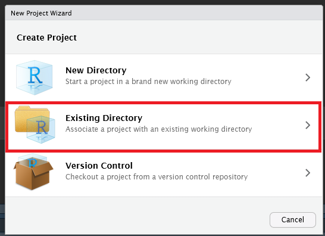

- Browse and select the `MYPROJECT` directory you created
  [earlier](#prepare-your-working-environment)

- Open a new R Script file by clicking "File -> New File -> R Script"

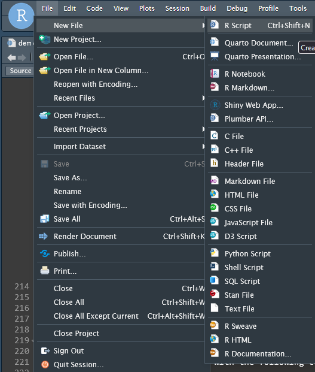

- Save you file and give it a name, I will use **demo.R** for this tutorial.

## Read in quantified abundance files

We will use the Bioconductor
[tximport](https://bioconductor.org/packages/release/bioc/html/tximport.html)
package to read in our quantified abundance tables using the **samples.csv**
file as a guide.

In your R script file add the following code:

```r
# Load Libraries
library(here)
library(rio)
library(CustomRFuncs) # install using devtools::install_github("fbearoff/CustomRFuncs")
library(DESeq2)
library(data.table)
library(readr)
library(tximport)

here::i_am("demo.R") ## THIS MUST MATCH THE FILENAME

## What species?
## "rnorvegicus", "mmusculus", "hsapiens"
species <- "hsapiens"

# TxImport
samples <-
  import(here("samples.csv"), header = TRUE)
rownames(samples) <- samples$sample.id
samples$mapped_percent <-
  import(here("salmon_output", "mapped_percent.txt"))[, 2]

files <- here("salmon_output", "quants", samples$sample.id, "quant.sf")
names(files) <- samples$sample.id
all(file.exists(files))
tx2gene <- as.data.table(getTx2gene(species))
txi <- tximport(files, type = "salmon", tx2gene = tx2gene[, 1:2])
txi_abund <- as.data.frame(txi$abundance)
gene_synonym <- unique(tx2gene[, -1])
txi_abund <- merge(txi_abund,
  gene_synonym,
  by.x = "row.names",
  by.y = "gene_id"
)
txi_abund <- dplyr::rename(txi_abund, gene_id = Row.names)
```

Run the above code by highlighting it and pressing `CTRL-ENTER`. This code first
imports our sample data and condition table and then maps sample names to the
appropriate files. It generates a `tx2gene` object which maps the transcripts we
quantified to their gene ID, and pulls in other relevant metadata including gene
name, genomic location, and description. Finally, a complete gene abundance
object named `txi_abundance` is generated.

We will now utilize
[DESeq2](https://bioconductor.org/packages/release/bioc/html/DESeq2.html) to
model our experimental data with the following code.

```r
# DESeq2
rownames(samples) <- colnames(txi$counts)
dds <- DESeqDataSetFromTximport(txi,
  colData = samples,
  design = ~condition
)
dds <- DESeq(dds)
```

We have created a DESeqDataSet object called `dds` which contains all our
samples modeled by the "condition" factor we specified in **samples.csv**. This
will be the basis for downstream analysis. More complex experimental designs
will alter the "design" formula, consult
[this vignette](http://bioconductor.org/packages/devel/bioc/vignettes/DESeq2/inst/doc/DESeq2.html)
for more information.

## QC

We will now generate a 2D PCA plot with the following code:

> **_NOTE:_** `CustomRFuncs` is an R package I have written containing functions
> wrapping generalized analysis tasks. These functions are opinionated and not
> designed for tweaking, you can access the underlying source code by simply
> typing the functions name in the R console. e.g. `plotPCA`

```r
CustomRFuncs::plotPCA(dds)
```

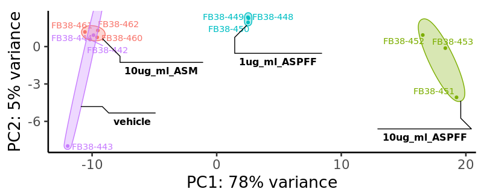

You should see a PCA plot pop up in the "Plots" tab in the lower right of the
RStudio interface that resembles the above figure. If you would like to save the
image click the "export" button.

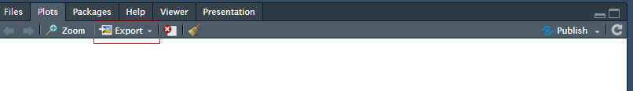

## Differential expression analysis

We will now start comparing different conditions in our experiment. I am using
example data from the [α-syn project](https://pubmed.ncbi.nlm.nih.gov/36571978/)
, so we will compare the monomer and oligomer α-syn treatments.

We can generate a comparison table using the following code:

```r
comp <- CustomRFuncs::compDESeq2("10ug_ml_ASM", "10ug_ml_ASPFF")
```

We can access the table by typing `comp` into the console or clicking its name
in the "Environment" tab in the upper right of the RStudio interface.

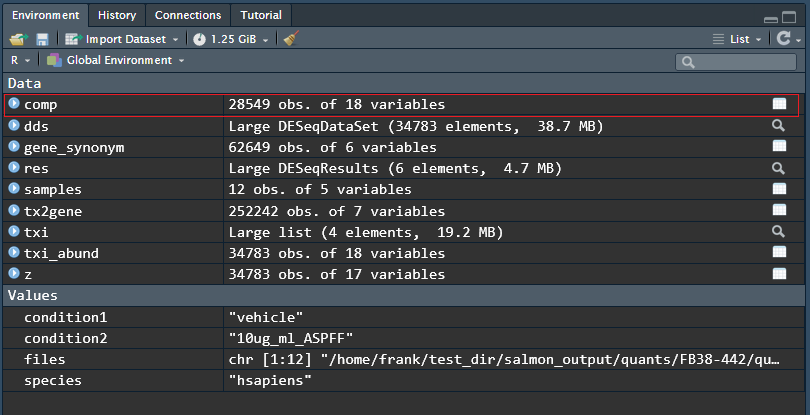

This comparison results table can be saved by running the following code:

```r
export(comp, "comp.csv")
```

Typical exploratory analysis figures we can make includes an MA plot that shows
mean expression against fold change:

```r
CustomRFuncs::plotMA("10ug_ml_ASM", "10ug_ml_ASPFF")
```

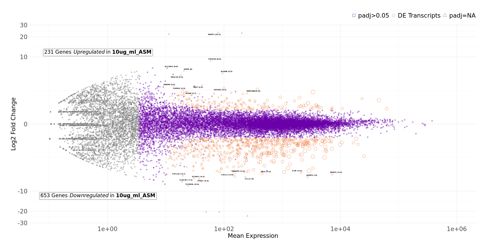

Volcano plot that shows significance against fold change:

```r
CustomRFuncs::plotVolcano("10ug_ml_ASM", "10ug_ml_ASPFF")
```

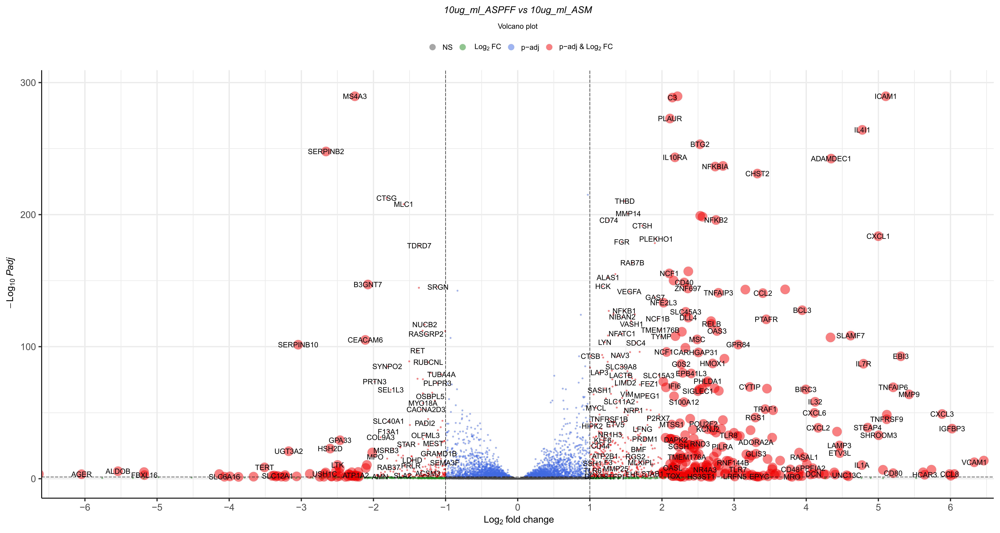

Clustered heatmap of top differentially expressed genes:

```r
CustomRFuncs::clusteredHeatmap("10ug_ml_ASM", "10ug_ml_ASPFF")
```

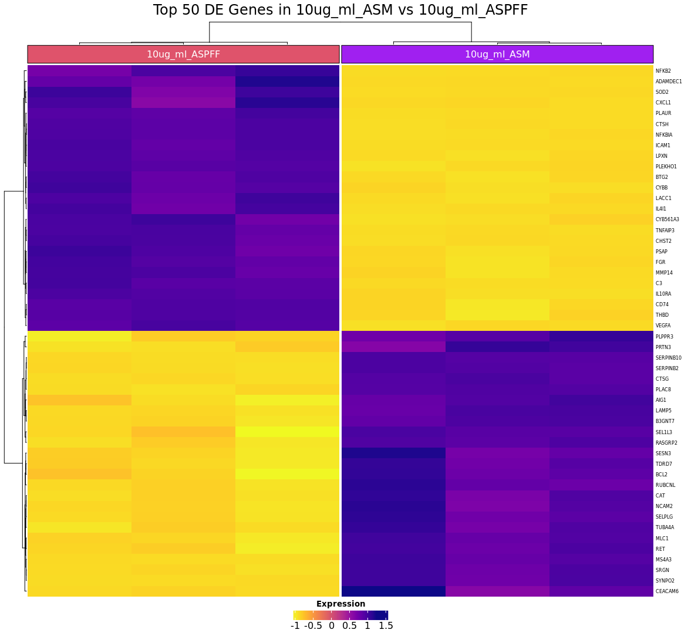

Plot a particular gene of interest:

```r
CustomRFuncs::plotGene("IL1B")
```

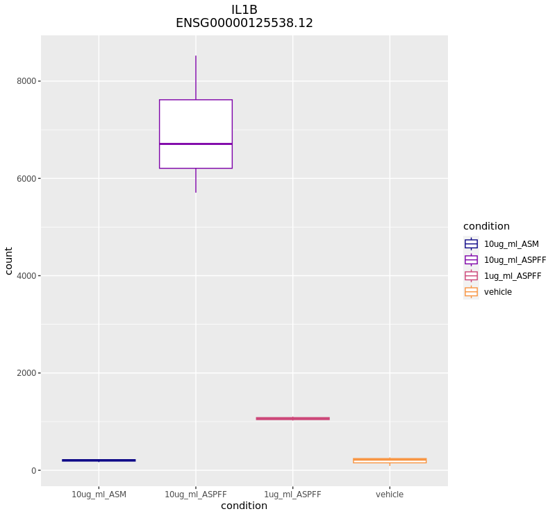

# Conclusion

I have shown you the basics of performing a basic differential expression
analysis of RNAseq data. This is only scratching the surface of what is
possible, more advanced analyses may include GO enrichment, pathway analysis,
and cell-signature analysis. I encourage you to thoroughly read
[the DESeq2 vignette](http://bioconductor.org/packages/devel/bioc/vignettes/DESeq2/inst/doc/DESeq2.html)
and play around with R to get the most out of your data.
